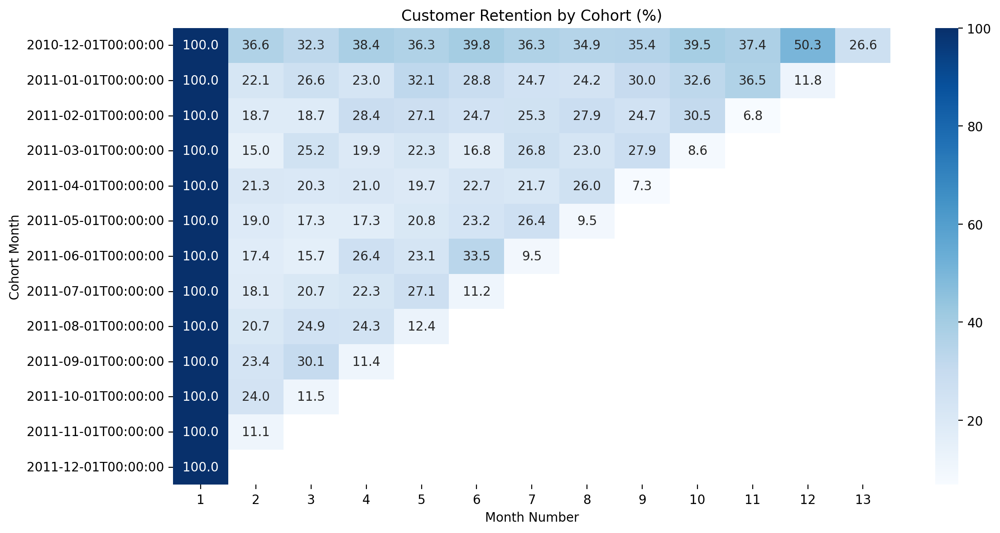
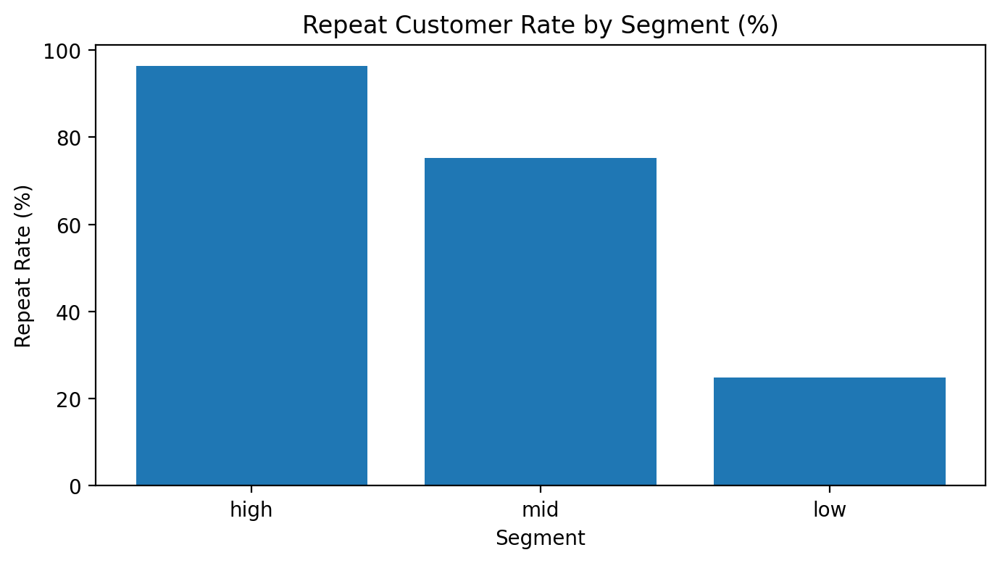

# Customer Retention & Cohort Analysis

## Executive Summary

Customer retention is highly front-loaded: most customers drop off after their first purchase, while a smaller high-value segment drives repeat behavior and long-term revenue.

This project analyzes retention patterns, identifies customer segments, and translates findings into actionable business recommendations.

---

## Business Problem

In ecommerce, growth depends not only on acquiring customers but also on retaining them.

Key questions:
- How many customers return after their first purchase?
- When do customers drop off?
- Which customer segments drive repeat purchases?
- How can retention be improved?

---

## Dataset

- Source: UCI Online Retail dataset  
- Transactions-level ecommerce data  
- Key fields:
  - `customerid`
  - `invoicedate`
  - `quantity`
  - `unitprice`
  - `country`

---

## Approach

This project follows a practical analytics workflow:

1. Data cleaning and preparation  
2. Revenue calculation at transaction level  
3. Customer segmentation (low / mid / high value)  
4. Order-level aggregation  
5. Cohort construction (first purchase month)  
6. Retention matrix calculation  
7. KPI: Repeat Customer Rate  
8. Segment-level behavior comparison  

---

## Key Metrics

### Retention Rate
Percentage of customers returning in subsequent months after first purchase.

### Repeat Customer Rate
Share of customers who made more than one purchase.

---

## Retention Analysis

### Insight
- Strong drop-off after first purchase  
- Retention stabilizes after early periods  
- Indicates onboarding / first experience is critical  

---

## Repeat Purchase Behavior

### Insight
- High-value customers show significantly higher repeat rates  
- Low-value segment has minimal retention contribution  
- Revenue is concentrated in a small group of repeat buyers  

---

## Segment-Level Findings

- **Low segment**
  - Mostly one-time buyers  
  - Low contribution to long-term revenue  

- **Mid segment**
  - Moderate repeat behavior  
  - Opportunity for targeted retention campaigns  

- **High segment**
  - Strong repeat behavior  
  - Core revenue drivers  

---

## Business Recommendations

1. Improve first purchase experience  
   → onboarding, delivery, product quality  

2. Focus retention efforts on mid-value customers  
   → highest ROI segment for growth  

3. Build loyalty programs for high-value customers  
   → maximize lifetime value  

4. Reduce dependency on one-time buyers  
   → shift from acquisition-heavy to retention-driven growth  

---

## Technical Implementation

### Python (pandas)
- groupby / aggregation  
- cohort construction using datetime logic  
- pivot tables for retention matrix  
- segmentation using revenue distribution  

### SQL Equivalent
- CTEs for step-by-step transformations  
- NTILE for segmentation  
- DATE_TRUNC for cohort grouping  
- Aggregations for retention calculation  

---

## Project Structure
customer-retention-cohort-analysis/
│
├── notebooks/
│ └── customer_retention_cohort_analysis.ipynb
├── images/
│ ├── retention_heatmap.png
│ └── segment_repeat_rate.png
├── README.md

---

## Key Takeaways

- Retention drops sharply after first purchase  
- Repeat behavior is concentrated in high-value customers  
- Mid-tier customers offer the best growth opportunity  
- Retention strategy is critical for sustainable ecommerce growth  

---

## Author

Data Analyst focused on:
- SQL
- Python (pandas)
- Business analytics
- Fraud & ecommerce analysis
